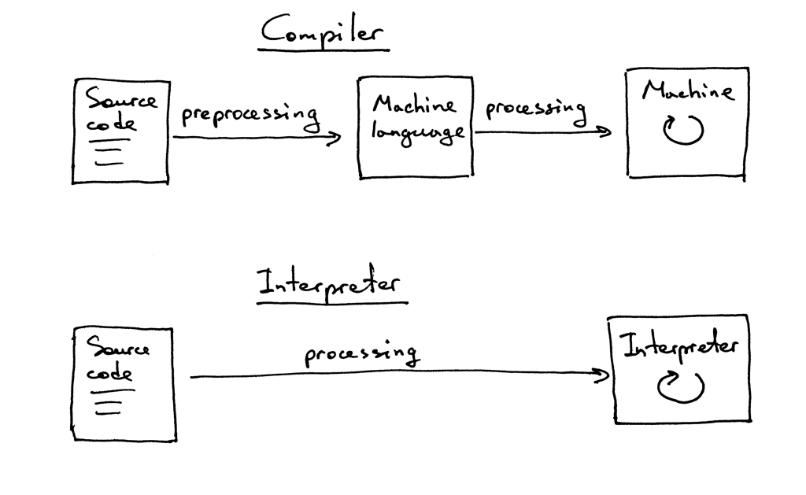

# Exercises

1. Modify the code to allow multiple-digit integers in the input, for example “12+3”
2. Add a method that skips whitespace characters so that your calculator can handle inputs with whitespace characters like ” 12 + 3”
3. Modify the code and instead of ‘+’ handle ‘-‘ to evaluate subtractions like “7-5”

# Questions

What is an interpreter?

The translator processes and executes the source program without translating it into machine language first

What is a compiler?

if a translator translates a source program into machine language

What’s the difference between an interpreter and a compiler?

What is a token?

A token is an object that has a type and value

What is the name of the process that breaks input apart into tokens?

lexical analysis

What is the part of the interpreter that does lexical analysis called?

lexical analyzer

What are the other common names for that part of an interpreter or a compiler?

scanner, tokenizer
